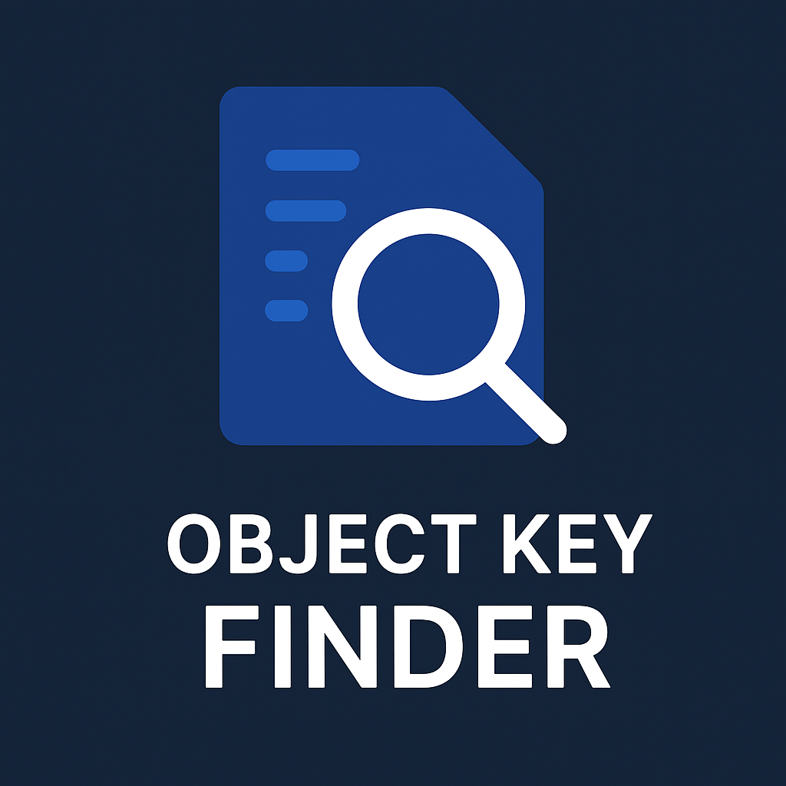

# JSON Key Search (VS Code Extension)

<p align="center">
  
  
</p>

Search deeply nested keys in JSON/JSONC and JS/TS object literals using dot notation. Precisely selects the matching value (string content only, or the full token/object/array for non-strings) and supports a live search UI similar to Ctrl+F.

## Features

- Exact dot-path lookup with structure-aware nesting (no false matches from siblings)
- Works with JSON/JSONC and JS/TS objects (quoted and unquoted keys)
- Selects just the final value content
- Live search input that updates selection as you type

## Requirements

- VS Code ^1.75.0

## Commands

- `extension.searchJsonKey`: One-shot input. Jumps to the value of the provided dot-path.
- `extension.searchJsonKeyLive`: Live search input. Updates selection on each keystroke.

## Default Keybinding

- Live search: `Ctrl+Alt+J` (Windows/Linux), `Cmd+Alt+J` (macOS)

## How to Use (for Marketplace)

- Open a JSON/JSONC/JS/TS file containing nested objects.
- Press the default keybinding or run the command from the Command Palette:
  - “Search JSON Field by Dot Notation (Live)” for a live Ctrl+F-like search.
  - “Search JSON Field by Dot Notation” for a single prompt.
- Type a path like `messages.errors.no_permission`.
- The extension selects only the value of that key (string content without quotes, or the full non-string value).

## Usage

1. Open a JSON/JSONC/JS/TS file that contains nested data.
2. Run a command:
   - Command Palette → “Search JSON Field by Dot Notation” (one-shot), or
   - Command Palette → “Search JSON Field by Dot Notation (Live)” (live UI), or
   - Press the default keybinding for the live search.
3. Enter a dot-path, e.g. `messages.errors.no_permission`.
4. The extension will select only the final value.

## Examples

Given:

```ts
export const en = {
  pages: {
    login: {
      title: 'Login',
      settings: {
        mac_address: { title: 'MAC' },
      },
    },
  },
  messages: {
    errors: {
      no_permission: 'You do not have permission',
    },
  },
}
```

- Searching `messages.errors.no_permission` selects: `You do not have permission` (inside quotes only).
- Searching `pages.login.settings.mac_address.title` selects: `MAC` (exact nesting; does not match `pages.login.title`).

## Installation (Local dev)

- Clone this repo, then open it in VS Code.
- Press F5 (Run Extension) to launch a new Extension Development Host.

## Packaging (optional)

- Use `vsce` if you want to package/publish:
  - Install: `npm i -g @vscode/vsce`
  - Package: `vsce package`

## Notes & Limitations

- The matcher is tolerant but still expects syntactically valid structures.
- For large files, live updates use a small debounce (≈120ms).
- Keys are matched exactly by segment; the final segment is not prefix-matched.

## License

MIT
